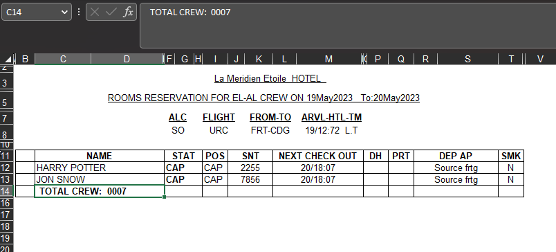
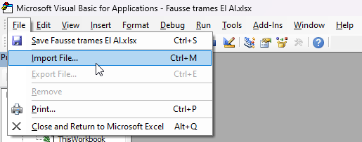
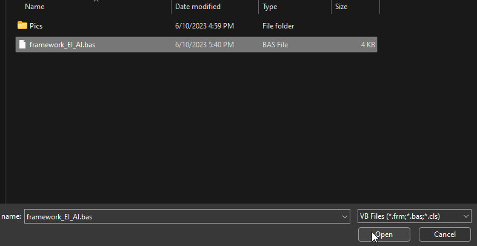
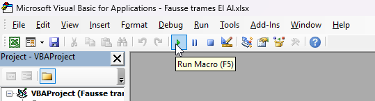
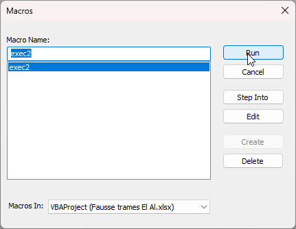

# Script EI AI framework

The script automatically resizes the Excel file to meet the printing requirements.

- Open the excel file.

- ALT + F11
- File -> Import File (Ctrl + M)

- Open framework_EI_AI.bas

- Run Macro (F5)

- Run (Enter)
